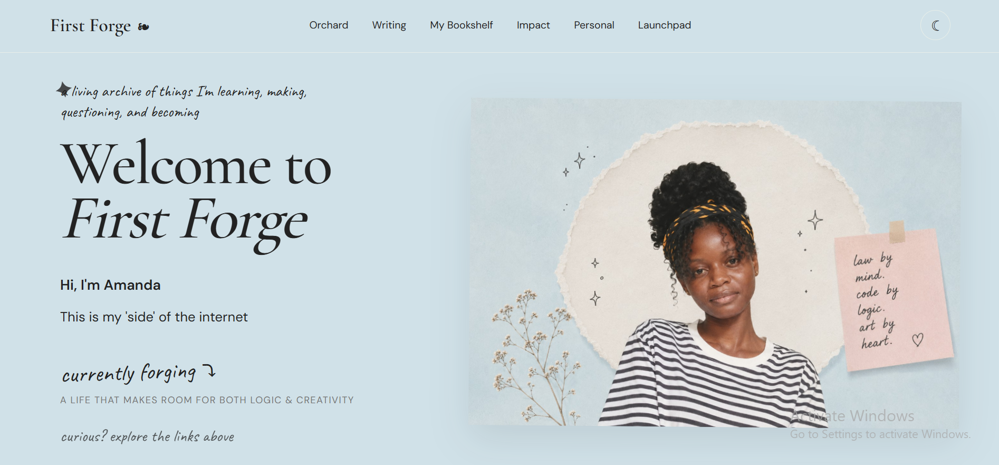
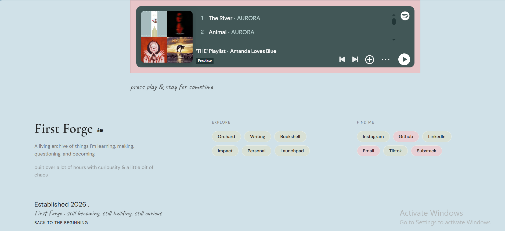

# First-Forge
Welcome to First Forge- my cozy corner of the internet and a digital garden
Live Site: https://first-forge.netlify.app/

First Forge is my personal website and digital archive.
It's a space where I can bring together different parts of myself that don't always fit neatly into one category — coding, creative projects, writing, research, law, sewing, learning, and the things I'm simply curious about.
Rather than being just a traditional portfolio, I wanted First Forge to feel like a living archive: something that can grow and change alongside me.

I hope you enjoy exploring it as much as i enjoyed coding and bringing it to life.

What's Inside:
**Orchard**
A collection of things I'm currently exploring and building, including: 
-Coding
-Creative projects
-Law & legal studies
-Sewing
-Research
-Online courses

**Writing**
A space for thoughts, reflections, observations and things I've learned along the way.

**My Bookshelf**
Books I'm reading, learning from, and keeping close-along with my thoughts and takeaways from them.

**Impact**
A record of the ways i try to contribute to my community throught the teaching, discussions, volunteering, leadership and creative service.

**Personal**
The less resume-friendly parts of me- hobbies, interests, current obsessions and little things that make me who I am.

**Launchpad**
A staging ground for projects, academic goals, research ideas and things I want to build in the future

Built With
-HTML 5
- CSS3
- JavaScript
- Google Fonts

Design
First Forge was designed around a soft, minimal, editorial-inspired aesthetic cause that's how I wanted it.

The visual language combines:
-Soft sage
-Dusty rose
-Warm paper tones
-Serif typography
-Handwritten accents
-Subtle cards and textures

Features
-Responsive layout
-Multi-page navigation
-Light/dark mode
-Personal portfolio sections
-Project and learning archive
-Bookshelf
-Writing section
-Interactive elements
-Custom visual styling

To view First Forge locally on your machine: 
1. **Clone the repository**: https://github.com/Amanda101322/First-Forge
2. **Open the project folder** in your code editor or file manager.
3. Launch the site: **Double-click or open 'index.html' in your browser
You will not need any framework or build process.

There might be changes in future as pages,projects, writing and experiments will continue to evolve as I learn and build more

**Author**-Amanda
Graphic designer, student and builder exploring the intersection of creativity, technology, finance, law, and everything in between.
Built with care

